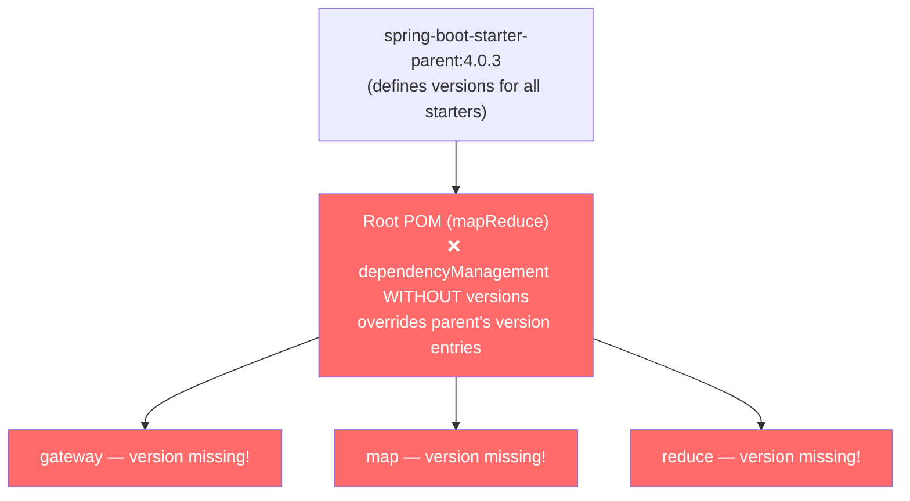

# Maven Multi-Module Build Fix — Walkthrough

## What Went Wrong

The `mvn clean package` command failed with **9 errors** — all three child modules (`gateway`, `map`, `reduce`) reported missing dependency versions for every Spring Boot starter.

### Root Cause 1: `<dependencyManagement>` overriding the inherited BOM

This was the **primary** build-breaking issue.

Your root POM inherits from `spring-boot-starter-parent:4.0.3`, which already provides a complete `<dependencyManagement>` section with versions for **every** Spring Boot starter. However, the root POM re-declared its own `<dependencyManagement>` block with the same artifacts **without specifying `<version>`**.

**Why this breaks:** In Maven, when a child POM declares `<dependencyManagement>` entries with the same `groupId:artifactId` as the parent, the child's entries **override** the parent's. Since the root POM's entries didn't include `<version>`, the effective version became `null` — breaking all child modules.



### Root Cause 2: Non-existent artifact names

Several artifact IDs in the root POM **don't exist** in Maven Central:

| ❌ Non-existent | ✅ Correct alternative |
|---|---|
| `spring-boot-starter-amqp-test` | `spring-amqp-test` |
| `spring-boot-starter-webmvc-test` | `spring-boot-starter-test` |
| `spring-boot-starter-kafka-test` | `spring-kafka-test` |

### Root Cause 3: Deprecated starter name

Spring Boot 4.0 renamed `spring-boot-starter-web` → `spring-boot-starter-webmvc`. The child modules were still using the old name.

---

## Changes Made

### [pom.xml](file:///Users/harsha/Desktop/Map-Reduce/pom.xml) (root)

**Removed** the entire `<dependencyManagement>` block (90 lines) and replaced it with a simple `<dependencies>` section containing only shared deps (`lombok` + `spring-boot-starter-test`). Versions are now correctly resolved from `spring-boot-starter-parent`.

```diff:pom.xml
<?xml version="1.0" encoding="UTF-8"?>
<project xmlns="http://maven.apache.org/POM/4.0.0"
	xmlns:xsi="http://www.w3.org/2001/XMLSchema-instance"
	xsi:schemaLocation="http://maven.apache.org/POM/4.0.0 https://maven.apache.org/xsd/maven-4.0.0.xsd">
	<modelVersion>4.0.0</modelVersion>
	<packaging>pom</packaging>
	<parent>
		<groupId>org.springframework.boot</groupId>
		<artifactId>spring-boot-starter-parent</artifactId>
		<version>4.0.3</version>
		<relativePath /> <!-- lookup parent from repository -->
	</parent>
	<groupId>com.flash</groupId>
	<artifactId>mapReduce</artifactId>
	<version>0.0.1-SNAPSHOT</version>
	<name>mapReduce</name>
	<description>Demo project for Spring Boot</description>
	<url />
	<licenses>
		<license />
	</licenses>
	<developers>
		<developer />
	</developers>
	<scm>
		<connection />
		<developerConnection />
		<tag />
		<url />
	</scm>
	<properties>
		<java.version>24</java.version>
		<protobuf-java.version>4.33.4</protobuf-java.version>
	</properties>
	<modules>
		<module>gateway</module>
		<module>map</module>
		<module>reduce</module>
	</modules>
	<dependencyManagement>

		<dependencies>
			<dependency>
				<groupId>org.springframework.boot</groupId>
				<artifactId>spring-boot-starter-amqp</artifactId>
			</dependency>
			<!--		<dependency>-->
			<!--			<groupId>org.springframework.boot</groupId>-->
			<!--			<artifactId>spring-boot-starter-data-jpa</artifactId>-->
			<!--		</dependency>-->
			<dependency>
				<groupId>org.springframework.boot</groupId>
				<artifactId>spring-boot-starter-kafka</artifactId>
			</dependency>
			<dependency>
				<groupId>org.springframework.boot</groupId>
				<artifactId>spring-boot-starter-webmvc</artifactId>
			</dependency>
			<dependency>
				<groupId>org.springframework.boot</groupId>
				<artifactId>spring-boot-starter-web</artifactId>
			</dependency>
			<dependency>
				<groupId>org.springframework.boot</groupId>
				<artifactId>spring-boot-starter</artifactId>
			</dependency>
			<dependency>
				<groupId>org.springframework.boot</groupId>
				<artifactId>spring-boot-starter-test</artifactId>
				<scope>test</scope>
			</dependency>

			<!--		<dependency>-->
			<!--			<groupId>org.postgresql</groupId>-->
			<!--			<artifactId>postgresql</artifactId>-->
			<!--			<scope>runtime</scope>-->
			<!--		</dependency>-->
			<dependency>
				<groupId>org.projectlombok</groupId>
				<artifactId>lombok</artifactId>
				<optional>true</optional>
			</dependency>
			<dependency>
				<groupId>org.springframework.boot</groupId>
				<artifactId>spring-boot-starter-amqp-test</artifactId>
				<scope>test</scope>
			</dependency>
			<!--		<dependency>-->
			<!--			<groupId>org.springframework.boot</groupId>-->
			<!--			<artifactId>spring-boot-starter-data-jpa-test</artifactId>-->
			<!--			<scope>test</scope>-->
			<!--		</dependency>-->
			<dependency>
				<groupId>org.springframework.boot</groupId>
				<artifactId>spring-boot-starter-kafka-test</artifactId>
				<scope>test</scope>
			</dependency>
			<dependency>
				<groupId>org.springframework.boot</groupId>
				<artifactId>spring-boot-starter-webmvc-test</artifactId>
				<scope>test</scope>
			</dependency>
			<dependency>
				<groupId>org.springframework.boot</groupId>
				<artifactId>spring-boot-testcontainers</artifactId>
				<scope>test</scope>
			</dependency>
			<dependency>
				<groupId>org.testcontainers</groupId>
				<artifactId>testcontainers-junit-jupiter</artifactId>
				<scope>test</scope>
			</dependency>
			<dependency>
				<groupId>org.testcontainers</groupId>
				<artifactId>testcontainers-kafka</artifactId>
				<scope>test</scope>
			</dependency>
			<dependency>
				<groupId>org.testcontainers</groupId>
				<artifactId>testcontainers-postgresql</artifactId>
				<scope>test</scope>
			</dependency>
			<dependency>
				<groupId>org.testcontainers</groupId>
				<artifactId>testcontainers-rabbitmq</artifactId>
				<scope>test</scope>
			</dependency>
		</dependencies>
	</dependencyManagement>


	<build>
		<pluginManagement>
			<plugins>
				<!-- Declared here so children inherit it and can run independently -->
				<plugin>
					<groupId>org.springframework.boot</groupId>
					<artifactId>spring-boot-maven-plugin</artifactId>
					<configuration>
						<excludes>
							<exclude>
								<groupId>org.projectlombok</groupId>
								<artifactId>lombok</artifactId>
							</exclude>
						</excludes>
					</configuration>
				</plugin>
			</plugins>
		</pluginManagement>
	</build>

</project>
===
<?xml version="1.0" encoding="UTF-8"?>
<project xmlns="http://maven.apache.org/POM/4.0.0"
	xmlns:xsi="http://www.w3.org/2001/XMLSchema-instance"
	xsi:schemaLocation="http://maven.apache.org/POM/4.0.0 https://maven.apache.org/xsd/maven-4.0.0.xsd">
	<modelVersion>4.0.0</modelVersion>
	<packaging>pom</packaging>
	<parent>
		<groupId>org.springframework.boot</groupId>
		<artifactId>spring-boot-starter-parent</artifactId>
		<version>4.0.3</version>
		<relativePath /> <!-- lookup parent from repository -->
	</parent>
	<groupId>com.flash</groupId>
	<artifactId>mapReduce</artifactId>
	<version>0.0.1-SNAPSHOT</version>
	<name>mapReduce</name>
	<description>Demo project for Spring Boot</description>
	<url />
	<licenses>
		<license />
	</licenses>
	<developers>
		<developer />
	</developers>
	<scm>
		<connection />
		<developerConnection />
		<tag />
		<url />
	</scm>
	<properties>
		<java.version>24</java.version>
		<protobuf-java.version>4.33.4</protobuf-java.version>
	</properties>
	<modules>
		<module>gateway</module>
		<module>map</module>
		<module>reduce</module>
	</modules>
	<!-- Shared dependencies inherited by ALL child modules.
	     Versions are managed by spring-boot-starter-parent — do NOT redeclare them here. -->
	<dependencies>
		<dependency>
			<groupId>org.projectlombok</groupId>
			<artifactId>lombok</artifactId>
			<optional>true</optional>
		</dependency>
		<dependency>
			<groupId>org.springframework.boot</groupId>
			<artifactId>spring-boot-starter-test</artifactId>
			<scope>test</scope>
		</dependency>
	</dependencies>


	<build>
		<pluginManagement>
			<plugins>
				<!-- Declared here so children inherit it and can run independently -->
				<plugin>
					<groupId>org.springframework.boot</groupId>
					<artifactId>spring-boot-maven-plugin</artifactId>
					<configuration>
						<excludes>
							<exclude>
								<groupId>org.projectlombok</groupId>
								<artifactId>lombok</artifactId>
							</exclude>
						</excludes>
					</configuration>
				</plugin>
			</plugins>
		</pluginManagement>
	</build>

</project>
```

### [gateway/pom.xml](file:///Users/harsha/Desktop/Map-Reduce/gateway/pom.xml), [map/pom.xml](file:///Users/harsha/Desktop/Map-Reduce/map/pom.xml), [reduce/pom.xml](file:///Users/harsha/Desktop/Map-Reduce/reduce/pom.xml)

- Changed `spring-boot-starter-web` → `spring-boot-starter-webmvc`
- Removed `spring-boot-starter` and `spring-boot-starter-test` (now inherited from root)

---

## Validation

```
[INFO] Reactor Summary for mapReduce 0.0.1-SNAPSHOT:
[INFO]
[INFO] mapReduce .......................................... SUCCESS [  0.035 s]
[INFO] gateway ............................................ SUCCESS [  1.791 s]
[INFO] map ................................................ SUCCESS [  1.099 s]
[INFO] reduce ............................................. SUCCESS [  1.085 s]
[INFO] BUILD SUCCESS
[INFO] Total time:  4.115 s
```

All 3 tests pass. All 3 modules compile, test, and package into Spring Boot JARs.

---

## Best Practices for Maven Multi-Module Spring Boot Projects

### 1. Don't re-declare `<dependencyManagement>` when using `spring-boot-starter-parent`

`spring-boot-starter-parent` already manages versions for 400+ dependencies. Adding your own `<dependencyManagement>` **overrides** those entries. Only use it when you need to:
- Add a dependency not managed by Spring Boot
- Override a specific version (and you must then specify the version!)

### 2. `<dependencies>` vs `<dependencyManagement>` — know the difference

| | `<dependencies>` in parent | `<dependencyManagement>` in parent |
|---|---|---|
| **Adds dependency to children?** | ✅ Yes, automatically | ❌ No, child must opt-in |
| **Controls version?** | ✅ Yes | ✅ Yes (when child opts in) |
| **Use case** | Shared deps all modules need | Version governance without forcing deps |

### 3. Use the correct Spring Boot 4.x starter names

Spring Boot 4.0 renamed several starters per its modularization:

| Old (≤ 3.x) | New (4.x) |
|---|---|
| `spring-boot-starter-web` | `spring-boot-starter-webmvc` |

Always verify artifact names on [Maven Central](https://search.maven.org/) before adding dependencies.

### 4. Keep child POMs minimal

Child modules should only declare dependencies **unique to that module**. Shared dependencies belong in the root `<dependencies>` section. This avoids duplication and ensures consistency.

### 5. Use `pluginManagement` in root, `plugins` in children

This is already done correctly in your project — `pluginManagement` in root declares the Spring Boot Maven plugin configuration, and children activate it with a `<plugins>` reference.
